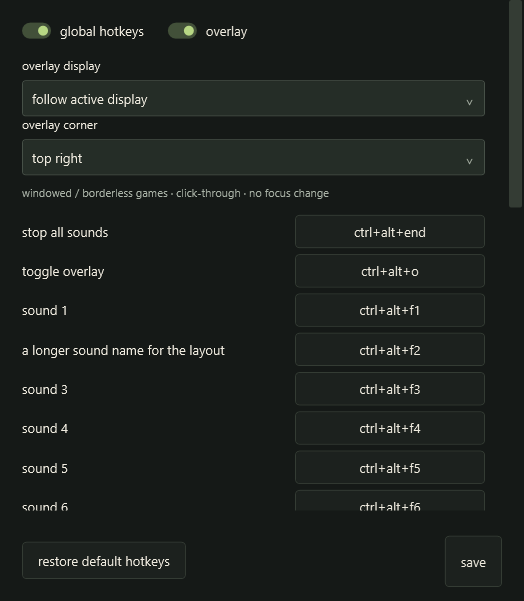
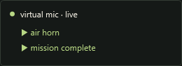

# gaming / upcoming 0.4 preview

start virtual mic, then minimize it or switch to your game. sounds are decoded
before audio starts; global hotkeys use the same play/retrigger path as pad clicks.
the microphone, effects and soundboard routing work as before.

## default global hotkeys

| action | default |
| --- | --- |
| sounds 1–11 | ctrl+alt+f1 through ctrl+alt+f11 |
| sound 12 | ctrl+alt+0 |
| sounds 13–23 | ctrl+alt+shift+f1 through ctrl+alt+shift+f11 |
| sound 24 | ctrl+alt+shift+0 |
| stop all sounds | ctrl+alt+end |
| toggle overlay | ctrl+alt+o |

f12 is deliberately excluded: [windows reserves it for the debugger](https://learn.microsoft.com/en-us/windows/win32/api/winuser/nf-winuser-registerhotkey).
these defaults avoid ordinary movement/action keys, but no shortcut is universal
across games. **gaming** lets you rebind or clear every pad/action, disable global
hotkeys, or restore defaults. hotkeys appear on the pads. holding a hotkey does
not repeatedly restart its sound; another press retriggers it.

windows registration conflicts are reported in the status bar and on affected
pads. open **gaming** and hover the affected sound to see the error, then choose
another chord or close the app holding it. available bindings keep working.
bindings are released when disabled or when virtual mic closes. gaming settings
temporarily suspend global bindings while the dialog is open. ordinary keys
1–9 and escape still work only while the main window has focus.

bindings belong to sound ids, so removing another pad does not shift them. an
imported sound gets the first unused default chord; a full/customized mapping can
leave a new sound unbound. only loaded pads are registered. the app must remain
open and its audio engine must be started; hotkeys do not start the microphone.

## overlay

the **overlay** toggle shows a small status indicator while the main window is in
the background, including when minimized. it displays live, mic muted, stopped,
or audio error. currently playing pads add their names below it, with four names
shown and a count for additional simultaneous sounds. completed/stopped pads
disappear; effect tails are not reported as still-playing pads.

the overlay is click-through, does not activate, and has no taskbar/alt-tab entry.
**gaming** selects any corner and either a specific display or **follow active
display**. a disconnected saved display falls back to the active display; it
returns to the saved display when reconnected. ctrl+alt+o or the main-window
toggle hides/shows it. settings and the main control window remain interactive.

the overlay supports desktop, windowed and borderless windowed games. it does
**not** inject into a game renderer and cannot reliably appear over exclusive
fullscreen. use borderless mode for the overlay. global hotkeys do not depend on
the overlay being visible, but a game's exclusive keyboard capture or security
restrictions can still prevent delivery; test the chosen game. neither feature
requires administrator privileges. do not elevate the app just to troubleshoot.

the indicator has no animations, meters, frame hook or continuous redraw. it
changes only when status or playing sounds change. display/focus placement is
checked twice a second while visible. minimized playback polls at 10 hz with
the overlay on, 4 hz with it off; main-window meters stop updating while minimized.

## upgrading and testing

close virtual mic and back up `%LOCALAPPDATA%\VirtualMic` before trying 0.4. extract
the entire portable zip, keeping `plugins` beside `VirtualMic.exe`. no driver or
windows default-device changes are needed for this update.

existing format 1/2 libraries get default chords in their current pad order.
the first save writes format **3** and preserves the previous file as `.bak`.
format 3 remembers cleared/custom bindings and overlay settings; older releases
refuse it. downgrade using your saved pre-upgrade library, not a later `.bak`.

first try a short sound in a windowed game: minimize virtual mic, press its
shortcut, confirm the name appears, then stop it with ctrl+alt+end. check retrigger,
overlap, mute, overlay toggle, display/corner changes, and conflicts with another
hotkey-owning app. compare your usual game's frame times with virtual mic closed,
live without effects, and live with your normal chain; keep game settings and the
workload the same. synthetic timings are in [performance](performance.md), and
do not establish game fps or driver/device behavior.
