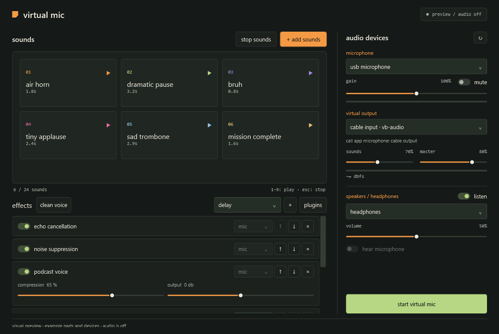

# local verification / 2026-09-29

## 0.3 bundled voice plugins

- release build: 0 warnings/errors; **48/48** core, DSP, capture-timing and plugin checks passed.
- all six effects load from external folders; the host has no built-in effect registration.
- unchanged API v1 fixture loads against the current shared contract.
- podcast compressor reduces a 20 dB input level difference and bounds overloads.
- synthetic steady-noise attenuation: **17.5 dB** after adaptation.
- synthetic delayed-echo attenuation: **21.9 dB** after adaptation. an independent
  173 Hz near-end test tone remained at 0.071 RMS during simultaneous playback.
  these signals are regression fixtures, not recorded human speech or a room test.
- native frame adapters handle irregular stereo chunks with zero managed
  allocations after warmup. mic-only scope and missing-reference bypass passed.
- timestamp alignment, +/-150 ppm reference drift, gaps, backlog limits and
  +/-1.5 ms packet jitter passed. the jitter regression was added after a real
  device check exposed overlapping reported timestamps.
- the published executable loaded/processed all bundled DLLs, including native APM.
- populated, cleanup, minimum-size, empty and error views rendered; preset, target
  restrictions, add/remove/reorder/parameter controls and isolated library checks passed.
- a silent 1.2-second capture-only check on the saved local mic/speaker endpoints
  passed: 57,600 microphone frames captured, valid timestamps, no capture errors.
  it opened no playback stream and saved no audio. this does not test actual echo removal.

**still pending for 0.3:** room/listening tests, Discord/Slack soundboard playback,
full mic/cable/monitor routing on the revised capture path, device removal/recovery,
long sessions and a fresh-machine run. earlier hardware output/listening results
below describe 0.1 and do not qualify the new capture path.

Reproduce with `scripts/build.ps1 -Publish` and `scripts/verify-ui.ps1`.
The optional capture-only command is documented in [voice processing](voice-processing.md).

## 0.2 plugin preview

the plugin build was checked separately from the original hardware/listening results below.

| check | result |
| --- | --- |
| release build | passed; 0 warnings, 0 errors |
| core + plugin checks | 35 / 35 passed |
| routing and lifecycle | mic/sounds/both, chain order, immutable parameter snapshots, state preservation, bypass/reset, factory/process faults, invalid samples, missing plugins, legacy migration, and concurrent edits passed |
| monitor + stopping | independent state prevents mic leakage into sounds-only monitoring; mute includes effects; stop sounds suppresses sound generators/tails |
| external plugin | delay reference dll: exact stereo timing at 30/240/1000 ms across partial blocks, dry/wet endpoints, feedback decay across buffer wraps, live parameter edits, reset, independent instances, and parameter extremes passed |
| single-file host | the published self-contained executable loaded the example dll and passed the same processing check |
| native controls | add/remove/reorder/bypass/target/parameter event wiring passed; populated, minimum-size, empty and error views rendered |
| isolated library | import/resampling, source preservation, rejected files, starter tones, and new effect settings persisted |
| real listening / call clients / long sessions | not yet repeated for 0.2; user testing pending |

reproduce with `scripts/build.ps1 -Publish` and `scripts/verify-ui.ps1`. these tests load only the example plugin/test fixtures and open no audio devices. the sample plugin build is staged in `artifacts/sample-plugins/delay`, without installing it into the user's app data.

## original 0.1 preview

tested the packaged windows x64 prototype locally before the plugin changes.

| check | result |
| --- | --- |
| release build | passed; 0 warnings, 0 errors |
| offline audio/core checks | 17 / 17 passed, including real byte/sample adapter boundaries |
| packaged wpf ui checks | passed; populated, empty, minimum-size, and audio-error views |
| file/library lifecycle | passed; mono 44.1 khz input converted to stereo 48 khz, source unchanged, corrupt audio rejected, starter tones generated, settings restored |
| windows device discovery | passed; cable input, cable in 16ch, and cable output detected after driver installation |
| vb-cable installation | official pack45 installed successfully; signed driver 3.3.1.7; windows device status ok; reboot completed |
| real wasapi endpoints | microphone capture, cable playback, and headphone playback opened successfully on the selected komplete audio 6 / vb-cable route |
| cable + monitor signal | quiet 997 hz tone detected at cable output and physical output loopback; measured peak block tone amplitudes 0.01123 and 0.00283 respectively |
| monitor recovery | listen off/on, missing monitor device, recovery, and engine stop/start passed; missing monitor did not stop the cable route |
| user listening | user confirmed the mic/monitor was working after the startup fix |
| real mic + clips through a cable into a call | call-client test still pending |
| measured end-to-end latency / long-session stability | not run |
| distribution | public preview; mit license; windows x64 portable package; stable qualification remains open |

the ui and library checks explicitly verified that audio was not opened. preview images use illustrative devices and sound names; the real library starts empty.

the driver was downloaded from the publisher and its installer signature and microsoft-signed hardware catalog were checked before installation. the user subsequently restarted windows. see [setup and first test](setup.md) for exact routing. new libraries prefer the standard stereo cable input rather than the optional 16-channel endpoint.

installation selected the cable as windows' normal playback default. this was corrected to the physical interface chosen by the user, and all three playback roles were verified afterward. the app itself does not set system defaults. the setup guide now calls out this installation side effect.

the simplified layout removes the tagline and decorative copy, uses compact control headings, shows volume percentages, and keeps audio errors next to the start/stop button. all normal controls fit at the minimum window size; the route panel can scroll when an error needs extra room. normal-size screenshot:

reproduce with `scripts/build.ps1 -Publish` and `scripts/verify-ui.ps1`. generated fixtures and device inventory stay in ignored `artifacts/`.

## startup / monitor fix

the first preview failed inside `SampleQueue.Read` because naudio 2's `SampleToWaveProvider` exposes a byte array as a float array. `Array.Copy` rejects those mismatched runtime array types, even for an empty monitor read. the previous unit checks used real float arrays and missed this boundary. the new regression failed on the old adapter with `Source array type cannot be assigned to destination array type.`

both output streams now use a real float buffer and an explicit byte copy. tests cover empty monitoring, buffered stereo data, byte offsets, underflow silence, and the capture-to-mixer-to-output path. monitoring opens only when listen is enabled; monitor failures preserve the primary route and report the actual exception beside the start button and in a local error log.

the optional hardware test uses the app's saved devices and standard vb-cable pair. with the .net 10 sdk installed, run `dotnet run --project tests/VirtualMic.AudioSmoke -c Release -- --run` while the app is stopped and you are outside a call. it plays a quiet two-second tone, keeps microphone audio muted, analyzes cable and headphone loopback samples in memory, and saves no audio. it deliberately tries a missing monitor once to check isolation; that expected fault appears in the diagnostic log. this test is separate from the normal build and ci.
